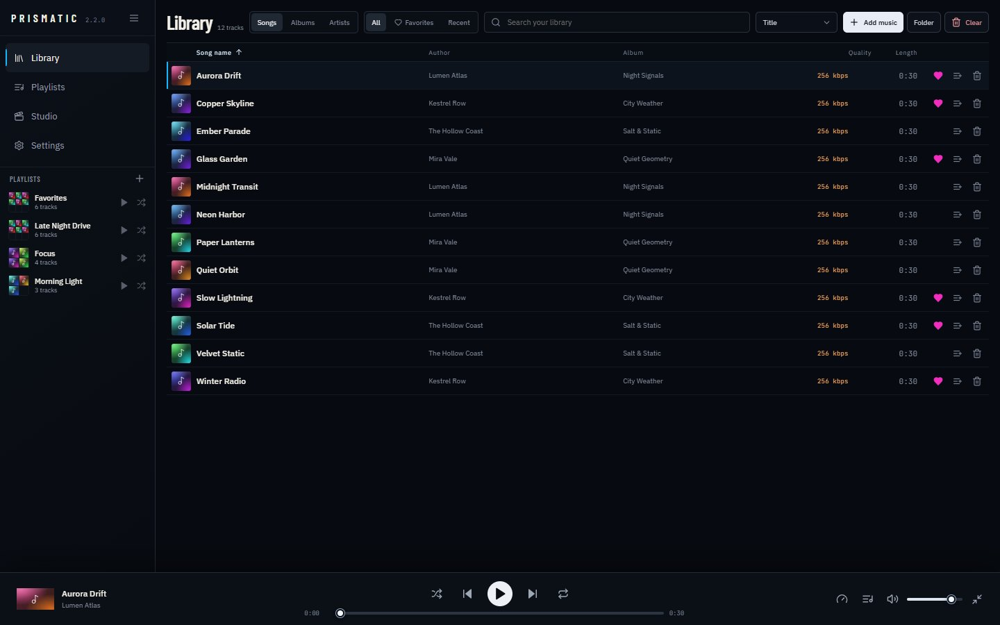
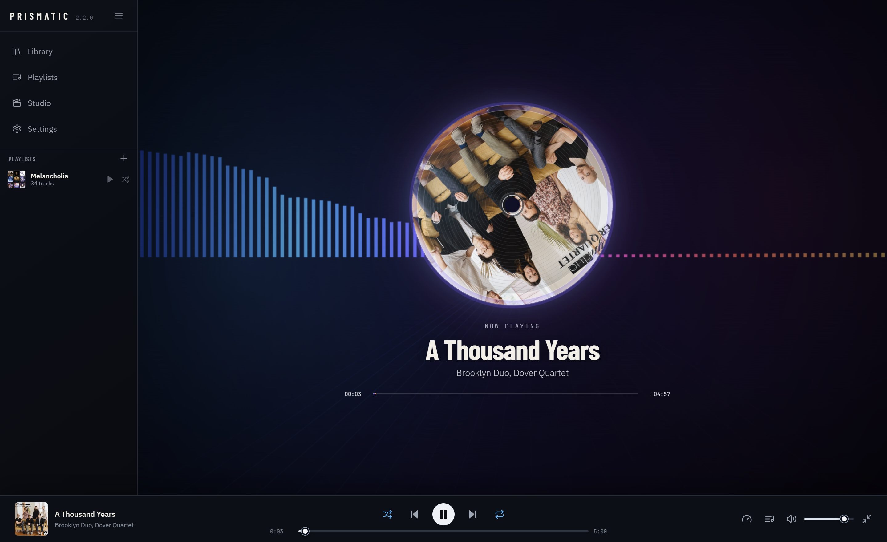
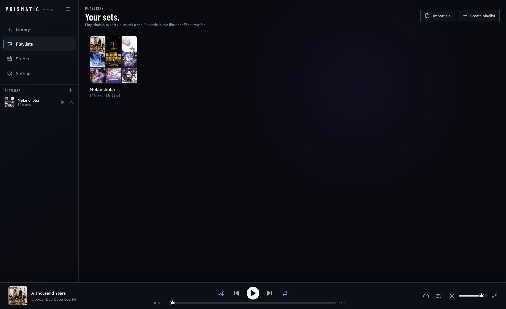
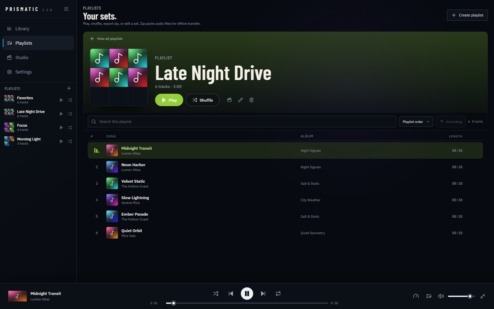
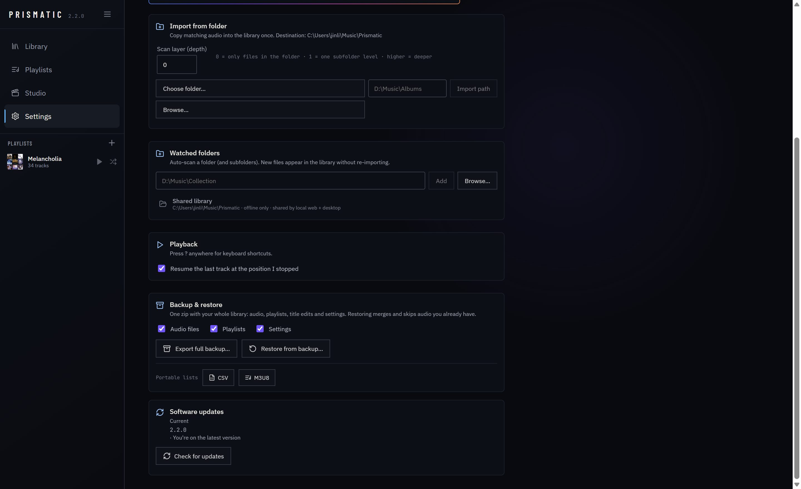
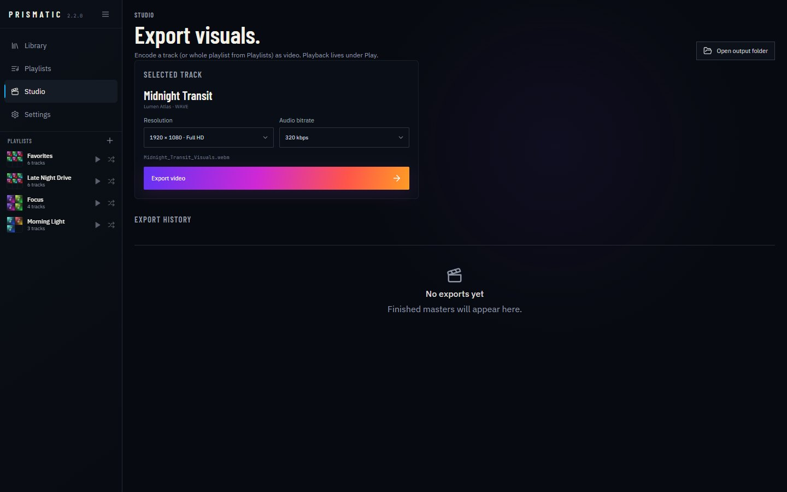

# Prismatic

A lightweight music player for **Windows** and **macOS**. Built for everyday listening first — clean library, solid queue, and a cinematic Now Playing view when you want it. Transfer playlists offline with **Export zip** / **Import zip**.

<p align="center">
  
</p>

## Highlights

- **Fast library** — songs, albums, artists, search, sort, favorites, recent, virtualized rows, right-click menu and multi-select
- **Full backup & restore** — one zip with your audio, playlists, title edits and settings; restores merge and skip what you already have
- **Persistent player** — keeps going while you browse, minimize, or switch tabs; resumes the last track and position after a restart
- **Queue you control** — shuffle, repeat, drag to reorder, play next
- **Speed & sleep timer** — 0.5×–2× with pitch preserved; fade out after 15/30/60 minutes or at the end of the track
- **Keyboard first** — press `?` for every shortcut
- **Open with & drag-and-drop** — double-click audio files, or drop files and folders anywhere in the window
- **Now Playing** — audio-reactive visuals without a heavy desktop runtime
- **Offline Studio** — export visuals on-device
- **Playlists, redesigned** — accent-tinted cards, a hero header, now-playing equalizer, drag-to-reorder rows, remove with Undo
- **Playlist zip** — export a set as a zip of audio files; import zip to forge a playlist
- **Desktop shell** — Tauri 2 on Windows/macOS (~2.5 MiB installer on Windows)
- **Auto-update** — signed updates from GitHub Releases (2.1.2+)

<p align="center">
  
</p>

## Download

Latest builds: **[GitHub Releases](https://github.com/Panther114/Prismatic/releases)**

| Platform | Package |
|---|---|
| Windows 10/11 x64 | `Prismatic_*_x64-setup.exe` |
| macOS 11+ (Apple Silicon) | `Prismatic_*_aarch64.dmg` |

Installers are **Authenticode-unsigned** for now — Windows may show SmartScreen. Prefer the `.sha256` checksums on the release.

**Auto-update (desktop 2.1.2+):** Settings → Software updates (or a quiet startup check). Builds older than 2.1.2 must install 2.1.2 once manually.

Your library lives at `Music/Prismatic` (plus a `.prismatic` state folder). Uninstalling the app does not wipe your music.

## Screenshots

| Library | Playlists |
|:---:|:---:|
|  |  |

| Playlist | Now Playing |
|:---:|:---:|
|  |  |

| Settings: backup & restore | Studio |
|:---:|:---:|
|  |  |

## Develop

```bash
pnpm install
pnpm dev          # http://localhost:4100
pnpm test
pnpm tauri:dev    # desktop shell
pnpm dist:win     # Windows NSIS + verify
```

Tag `v*` to run the [release workflow](.github/workflows/release.yml) (Windows + macOS + GitHub Release).

More detail: [ARCHITECTURE.md](ARCHITECTURE.md) · [RELEASE_NOTES.md](RELEASE_NOTES.md)

## License

Private project.
